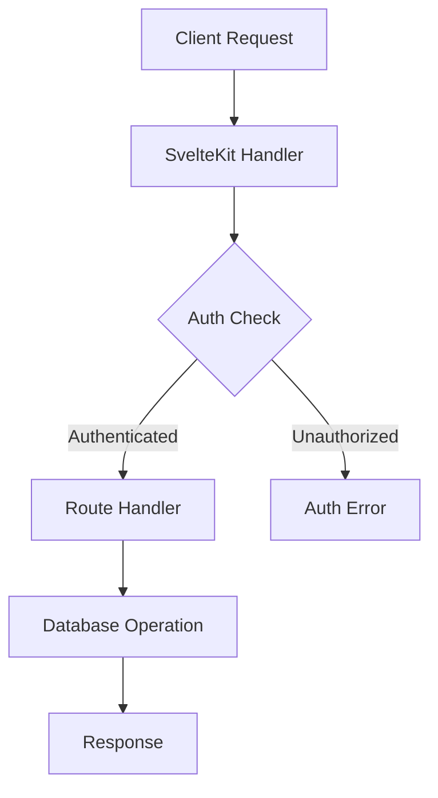

# SvelteCMS Architecture

This document provides a technical overview of SvelteCMS's architecture and core concepts.

## Core Architecture

### Technology Stack

- **Frontend**: SvelteKit, TypeScript
- **Backend**: Node.js, MongoDB
- **Build System**: Vite
- **Type System**: TypeScript
- **State Management**: Native Svelte stores
- **API Layer**: SvelteKit endpoints

### Core Components

```
src/
├── lib/
│   ├── core/           # Core CMS functionality
│   │   ├── auth/       # Authentication system
│   │   ├── collections/# Content type system
│   │   ├── fields/     # Field type system
│   │   └── plugins/    # Plugin system
│   ├── ui/            # UI components
│   └── utils/         # Shared utilities
└── routes/            # SvelteKit routes
```

## Key Systems

### 1. Collection System

Collections are the foundation of content management:

```typescript
interface Collection {
    name: string;
    fields: Field[];
    hooks: CollectionHooks;
    permissions: Permission[];
    options: CollectionOptions;
}

interface Field {
    type: FieldType;
    name: string;
    required: boolean;
    unique: boolean;
    validators: Validator[];
}
```

### 2. Plugin System

Plugins extend CMS functionality:

```typescript
interface Plugin {
    name: string;
    version: string;
    hooks: {
        beforeInit?: () => Promise<void>;
        afterInit?: () => Promise<void>;
        beforeRoute?: (event: RequestEvent) => Promise<void>;
    };
    components?: Record<string, SvelteComponent>;
    fields?: Record<string, FieldType>;
}
```

### 3. Authentication System

Multi-provider authentication:

```typescript
interface AuthProvider {
    name: string;
    type: 'oauth' | 'local' | 'custom';
    authenticate: (credentials: any) => Promise<User>;
    validate: (token: string) => Promise<User>;
}
```

## Data Flow

### 1. Request Lifecycle



### 2. State Management

```typescript
// Store definition
interface CMSStore {
    collections: Writable<Collection[]>;
    currentUser: Writable<User | null>;
    settings: Writable<Settings>;
}

// Store implementation
export const cms = {
    collections: writable([]),
    currentUser: writable(null),
    settings: writable(defaultSettings)
};
```

## Security Architecture

### 1. Authentication Flow

```typescript
// Authentication middleware
async function authenticate(event: RequestEvent) {
    const token = event.request.headers.get('authorization');
    if (!token) throw new Error('Unauthorized');
    
    const user = await validateToken(token);
    event.locals.user = user;
}
```

### 2. Permission System

```typescript
interface Permission {
    action: 'create' | 'read' | 'update' | 'delete';
    subject: string;
    conditions?: Record<string, any>;
}

// Permission check
function checkPermission(user: User, action: string, subject: string): boolean {
    return user.permissions.some(p => 
        p.action === action && 
        p.subject === subject
    );
}
```

## Performance Optimizations

### 1. Caching Strategy

```typescript
interface CacheConfig {
    type: 'memory' | 'redis';
    ttl: number;
    maxSize: number;
}

// Cache implementation
const cache = new Cache({
    type: 'memory',
    ttl: 3600,
    maxSize: 1000
});
```

### 2. Query Optimization

```typescript
// Optimized collection query
async function queryCollection(
    collection: string,
    query: Query,
    options: QueryOptions
) {
    const cacheKey = generateCacheKey(collection, query);
    const cached = await cache.get(cacheKey);
    if (cached) return cached;

    const result = await db
        .collection(collection)
        .aggregate([
            { $match: query },
            { $limit: options.limit }
        ]);

    await cache.set(cacheKey, result);
    return result;
}
```

## Development Guidelines

### 1. Code Organization

- Follow module pattern
- Use TypeScript for type safety
- Implement unit tests
- Document public APIs

### 2. Performance Best Practices

- Implement lazy loading
- Use SSR where appropriate
- Optimize database queries
- Implement proper caching

## Next Steps

1. [Plugin Development](../02_Development/01_Plugins.md)
2. [API Reference](../03_API/01_Overview.md)
3. [Security Guide](../04_Security/01_Overview.md)
